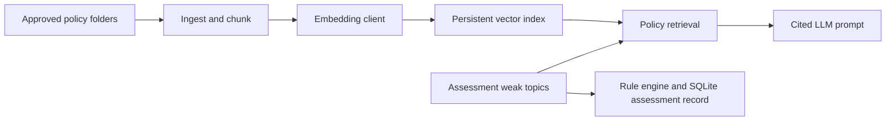

# Finance Intern Evaluation & RAG Planner

This project keeps two types of information deliberately separate:

- **Assessment data** is written to `intern_assessments.db` and is never an input to RAG ingestion.
- **Approved policy and training material** is read only from folders declared in `knowledge_sources.yaml` and becomes a searchable knowledge index.

The output is a manager-reviewed development recommendation, never an automatic employment decision.



## Quick start: offline mode

The default embedding provider is a deterministic local implementation. It needs no key and is suitable for demos and tests, not semantic-search production.

```powershell
$py = 'C:\Users\dalia\.cache\codex-runtimes\codex-primary-runtime\dependencies\python\python.exe'
& $py ingest_knowledge_base.py --config knowledge_sources.yaml
& $py pipeline.py
& $py -m unittest -v
```

`pipeline.py` uses `IndexedPolicyRetriever("data/policy_vectors.json")`, so its demo retrieves from the approved, indexed knowledge base. Run the ingestion command before running the pipeline. `KnowledgeBaseRetriever` provides the same indexed behavior with built-in sample content only as a fallback when no index exists.

## Knowledge-source configuration

Only folders named in `knowledge_sources.yaml` are scanned recursively:

```yaml
knowledge_sources:
  - path: knowledge_base/finance_policies
    category: finance_policy
    access_level: internal
  - path: knowledge_base/training_materials
    category: training
    access_level: internal
```

Add approved Markdown/text, DOCX, PDF, CSV, or XLSX files only to these folders. Keep an authoritative original and include front matter in Markdown where possible:

```yaml
---
title: Excel Controls for Finance
topics: excel, financial modeling
effective_date: 2026-01-01
version: 1.0
---
```

The ingestion command skips unchanged documents by content hash and replaces an individual document's old chunks when that document changes. It never removes indexed files globally; retiring a policy needs a deliberate administrative cleanup procedure.

## Format notes

- Markdown/text and CSV use built-in parsing.
- DOCX and XLSX use standard-library ZIP/XML parsing. Excel ingestion reads useful text, headings, sheet names, and rubric-like text; it intentionally ignores blank cells, lone numeric cells, and formulas without text context.
- PDF extraction needs the optional `pypdf` package. An uninstalled optional dependency produces a clear ingestion failure instead of silently indexing nothing.

## Production mode

Set `RAG_EMBEDDING_PROVIDER=openai` and set `RAG_EMBEDDING_MODEL` to your organization-approved embedding model. Install the provider SDK separately and provide its credential through the environment; never commit credentials. `.env.example` contains placeholders only.

`JsonVectorStore` is persistent but development-only. The `EmbeddingClient`, `VectorStore`, and `PolicyRetriever` boundaries let production use a PostgreSQL/pgvector adapter. Production also needs authentication, access-level enforcement from the identity provider, encryption, audit logging, policy-retention controls, document approval/version workflow, retrieval-quality evaluation, and LLM output validation.

## Safety and privacy

The loader rejects common database/config paths and scans only configured folders. Do not place assessment databases, personal information, secrets, source code, or unapproved documents inside the configured folders. Treat retrieved content as reference material, not instructions. Review every recommendation with a manager before use.
